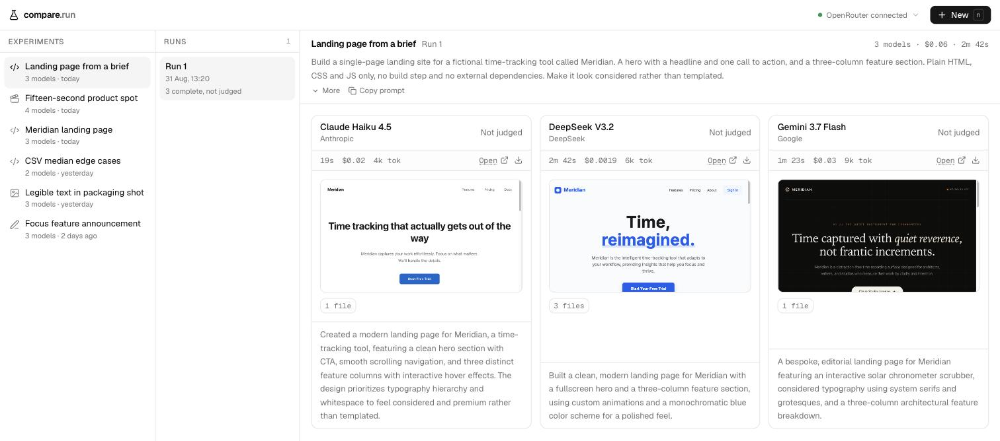

# compare.run

Run one prompt across many models and compare what each produced — side by side,
with the real cost and the real time it took.

The thesis: a screenshot of two chat windows is not a comparison. Holding the
prompt fixed, running it against several models at once, and keeping the history
is.



*One brief, three models, live output. Claude Haiku 4.5 finished in 19s for
$0.02; DeepSeek V3.2 took 2m 42s for $0.0019; Gemini 3.7 Flash took 1m 23s for
$0.03. An 18x cost spread and an 8x time spread on the same prompt — and three
pages that look nothing like each other. Those previews are the pages the models
actually wrote, rendered in sandboxed iframes.*

## Deploy your own

[](https://app.instapods.com/dashboard/pods/create?repo=https://github.com/vikasprogrammer/compare.run)

One click puts it on a real server with HTTPS. The wizard asks for the two API
keys below — both optional, and whichever you skip simply shows as not connected.

**Pick Node 24** in the create wizard. The default is 22, and this app stores
runs in SQLite through `node:sqlite`, which 22 does not have.

## Running it locally

```bash
npm install
cp .env.example .env.local   # add an OPENROUTER_API_KEY
npm run dev
```

Then open **http://localhost:4320** — use `localhost`, not `127.0.0.1`, or Next
blocks its own dev chunks and the page silently fails to hydrate.

Requires **Node 24**: runs are stored in SQLite via the built-in `node:sqlite`,
so there is no database server and no native module to compile.

## What it does

- **Experiments → runs → results.** One experiment holds many runs; each run
  holds one result per model, with its own output, cost, tokens and timing.
- **Runs snapshot what they were given.** The prompt and the model line-up live
  on the run, not the experiment, so editing the brief for a new run can never
  rewrite what an earlier run claims it ran.
- **Re-running is editing.** "Run again" opens the composer pre-filled; change
  the prompt or the line-up and the difference is recorded on the new run and
  shown as a word-level diff.
- **Four modalities.** Code (with the generated page rendered live), content,
  image, and video (real clips, played inline and downloadable).
- **Any model the provider carries.** The picker shows a curated shortlist by
  default and searches the provider's full catalogue behind "More models" —
  around 400 with OpenRouter connected. No code change to add one.

## Providers

Bring your own key. Two integrations ship, and between them they cover all four
modalities. Neither is required — the app runs with whichever keys you set, and
says plainly in the header what is connected and what is not.

Adding an integration is one file and one array entry: see
[PROVIDERS.md](./PROVIDERS.md).

| Provider | Modalities | Key |
|---|---|---|
| OpenRouter | code, content, image | `OPENROUTER_API_KEY` |
| fal.ai | video | `FAL_KEY` |

**A warning about video.** It is priced per second of output, so a clip costs
dollars where a text completion costs thousandths of a cent. A three-model video
comparison is a few dollars per run.

## Status

Early. The runner works and the comparisons are real across all four modalities.
There is still no way to record a judgement on a result — that is the next
meaningful piece.

## Stack

Next.js App Router, Tailwind, shadcn/ui, and SQLite via `node:sqlite` — no
database server and no native module.

## Licence

MIT — see [LICENSE](./LICENSE).
